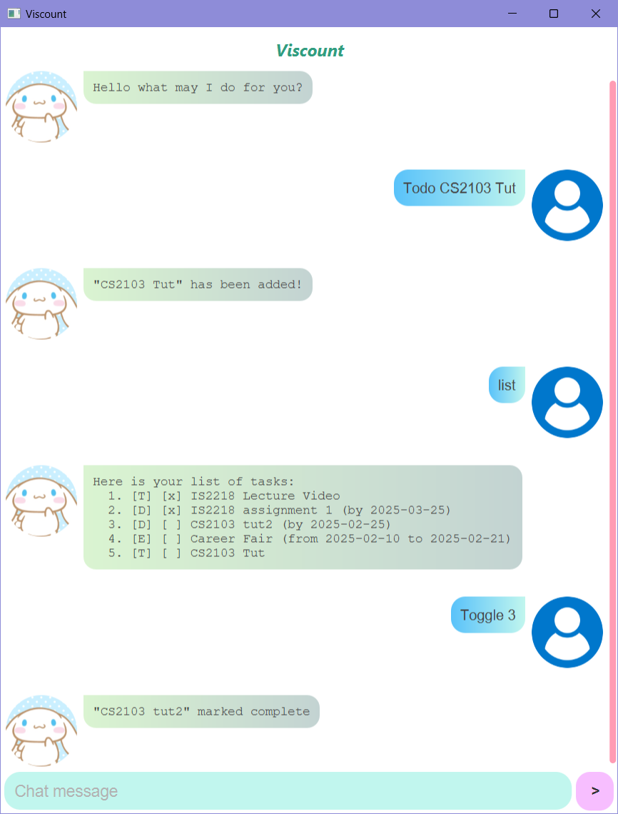

# Viscount User Guide

## Welcome to `Viscount`

It's not yet a Duke, meet 'Viscount'! For when you already have a calendar app in your pocket but want to make life a little more cumbersome. Viscount allows you to manage 3 different types of tasks that are automatically saved and retrieved when you open the chatbot!



---

## Table of Contents

- [Welcome to `Viscount`](#welcome-to-viscount)
- [Feature Overview](#feature-overview)
  - [Listing Your Tasks:list](#listing-your-tasks)
  - [Adding Todos](#adding-todos)
  - [Adding Deadlines](#adding-deadlines)
  - [Adding Events](#adding-events)
  - [Toggling Tasks](#toggling-a-task)
  - [Finding Tasks](#finding-a-task)
  - [Deleting Tasks](#deleting-a-task)
  - [Undoing Last Command](#undo-last-command)
      
- [Table of Commands](#table-of-commands)

## Feature Overview
> [!NOTE]  
> All commands are case-insensitive

> [!TIP]
> When you're done, just close Viscount by hitting the "x" in the top right corner. Don't worry, all changes are automatically saved!

### Listing Your Tasks
Viscount allows you to list all your tasks for easy viewing at a glance.

**Command Syntax:**
```
list
```

**Example:**
```
list
```

**Expected Outcome:**
```
Here is your list of tasks: 
  1. [T] [x] IS2218 Lecture Video
  2. [D] [x] IS2218 assignment 1 (by 2025-03-25)
  3. [D] [x] CS2103 tut2 (by 2025-02-25)
  4. [E] [ ] Career Fair (from 2025-02-10 to 2025-02-21)
  5. [T] [ ] CS2103 Tut
```

---

### Adding Todos
Viscount allows you to add todos, a simple task with a description.

**Command Syntax:**
```
todo <task description>
```

**Example:**
```
 todo assignment 2
```

**Expected Outcome:**
```
"assignment 2" has been added!
```

---

### Adding Deadlines
Viscount allows you to add deadlines, tasks which have a due date.

**Command Syntax:**
```
deadline <task description> /by <due date in YYYY-MM-DD format>
```

**Example:**
```
deadline Submit application /by 2025-02-28
```

**Expected Outcome:**
```
"Submit application" has been added!
```

---

### Adding Events
Viscount also allows you to add events, tasks that last for a specified duration of time. 

**Command Syntax:**
```
event <event description> /from <start date in YYYY:MM:DD format> /to <end date in YYYY:MM:DD format>
```

**Example:**
```
event Career Fair /from 2025-02-17 /to 2025-02-28
```

**Expected Outcome:**
```
"Career Fair" has been added!
```

---

### Toggling a Task
Completed a task? Simply toggle the task by its index to mark it as complete. Toggle an already completed task to mark it as incomplete.

**Command Syntax:**
```
toggle <task number>
```

**Example:**
```
toggle 1
```

**Expected Outcome:**
```
"IS2218 Lecture Video" marked complete
```
or
```
"IS2218 Lecture Video" marked incomplete
```
---

### Finding a Task
Need to look up tasks containing a search term? Find it!

**Command Syntax:**
```
find <search term>
```

**Example:**
```
find assignment
```

**Expected Outcome:**
```
Find: [assignment]
  2. [D] [x] IS2218 assignment 1 (by 2025-03-25)
```

---

### Deleting a Task
No longer need to keep track of a task? Delete it!

**Command Syntax:**
```
delete <task number>
```

**Example:**
```
delete 2
```

**Expected Outcome:**
```
"IS2218 assignment 1" deleted
```

---
### Undo Last Command
Accidentally added, toggled or deleted a task? Undo it! (Max undo history is one command)

**Command Syntax:**
```
undo
```

**Expected Outcome:**
```
Undo task SUCCESSFUL
Here are your tasks:
  1. [T] [x] IS2218 Lecture Video
  2. [D] [x] IS2218 assignment 1 (by 2025-03-25)
  3. [D] [x] CS2103 tut2 (by 2025-02-25)
  4. [E] [ ] Career Fair (from 2025-02-10 to 2025-02-21)
  5. [T] [ ] CS2103 Tut
```

---

### Table of Commands

| Command                           | Usage Example                                                                                                                                                     |
|-----------------------------------|-------------------------------------------------------------------------------------------------------------------------------------------------------------------|
| **[List](#listing-your-tasks)**   | `list`                                                                                                                                                            |
| **[Todo](#adding-todos)**         | `todo <task description>` <br> _E.g._ `todo Complete homework`                                                                                                    |
| **[Deadline](#adding-deadlines)** | `deadline <task description> /by <due date in YYYY-MM-DD format>` <br> _E.g._ `deadline Submit application /by 2025-02-28`                                        |
| **[Event](#adding-events)**       | `event <description> /from <start date in YYYY-MM-DD format> /to <end date in YYYY-MM-DD format>` <br> _E.g._ `event Career Fair /from 2025-02-17 /to 2025-02-28` |
| **[Toggle](#toggling-a-task)**    | `toggle <task number>` <br> _E.g._ `toggle 1`                                                                                                                     |      
| **[Find](#finding-a-task)**       | `find <search term>` <br> _E.g._ `find assignment`                                                                                                                |
| **[Delete](#deleting-a-task)**    | `delete <task number>` <br> _E.g._ `delete 4`                                                                                                                     |
| **[Undo](#undo-last-command)**    | `undo`                                                                                                                                                            |